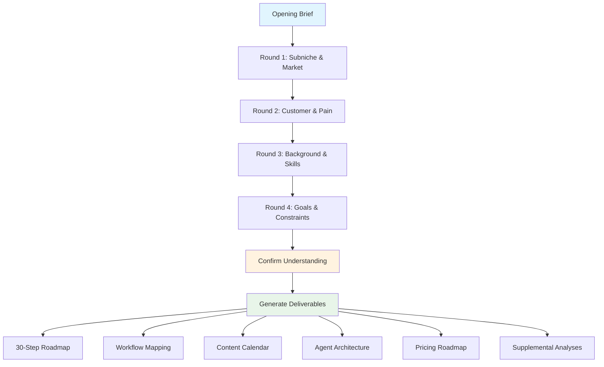

# claude-code-1p-saas


A Claude Code skill that guides solo founders through building an AI-powered SaaS business using a 30-step interactive playbook.

Based on Greg Eisenberg's 1-person SaaS framework, this skill conducts a deep consultation with 10-15 targeted questions, then generates 5+ fully customized strategic deliverables tailored to your specific niche, customers, and constraints.

## Problem

Solo founders and indie hackers face information overload when launching AI SaaS products. Advice is scattered across podcasts, Twitter threads, courses, and blog posts — none of it adapted to a specific founder's situation.

Traditional business planning tools are static and generic. They produce the same template output regardless of whether you're building a vertical AI tool for dentists or a workflow automation for real estate agents. There is no structured, interactive framework that adapts to a founder's specific niche, technical background, audience, and revenue goals.

The result: founders either spend weeks assembling a plan from fragmented sources, or they skip planning entirely and build the wrong thing.

## Features

- **Interactive 2-phase consultation** — Deep-dive questions (10-15 across 3-4 rounds) followed by customized deliverable generation. Not a questionnaire — an adaptive conversation.
- **Three strategic pillars** — Every recommendation is grounded in Subniche Focus, Media Company at Core, and Service-First then Software principles.
- **5+ customized deliverables** — 30-step execution roadmap, workflow mapping, 90-day content calendar, AI agent architecture, and pricing roadmap — all tailored to your niche.
- **Supplemental analyses on demand** — Subniche evaluation, task classification matrix, organic-to-paid pipeline, and moat building checklist generated when your situation calls for them.
- **9 reference templates** — Consistent, actionable output structure across all deliverables. No vague advice — every section has concrete fields to fill.
- **Adaptive questioning** — Questions adjust based on your domain expertise, technical background, and business stage. Irrelevant questions are skipped automatically.

## Usage

### Installation

Copy the skill directory to your Claude Code skills location:

```bash
cp -r claude-code-1p-saas/ ~/.claude/skills/1p-saas/
```

The skill activates automatically when you mention building a SaaS, AI startup, or software product as a solo founder. You can also invoke it directly by referencing the skill.

### Example Output

Below is an excerpt from a generated 30-step roadmap for a hypothetical **AI writing assistant for real estate agents**:

```
Phase 1 — Research & Validation (Steps 1-5)

Step 1: Subniche Definition
  - Your Subniche — AI listing description generator for independent real estate agents
  - Target Customer — Solo agents and small brokerages (1-5 agents) handling 10-30 listings/month
  - Why This Fits You — Your background in real estate tech + content marketing
    gives you domain credibility that generic AI writing tools lack
  - First Action — Interview 5 agents about their listing description workflow this week
  - Success Criteria — 3+ agents confirm they spend 30+ min per listing on copy

Step 3: Money Touchpoints
  - Listing publication — Agents pay $50-200/listing to platforms; your tool saves
    them copywriting time at this exact payment moment
  - Photography coordination — Descriptions must match photos; bundling with
    photo editing creates a higher-value workflow
  - Software Entry Point — Integrate at the MLS upload step where agents already
    have property data open

Step 4-5: Repetitive Steps & Cost Quantification
  - Mechanical repetitive steps — Writing property descriptions, formatting for
    multiple platforms (MLS, Zillow, Realtor.com), SEO keyword insertion
  - Time cost — 45 min/listing × 20 listings/month × $75/hr = $13,500/year per agent
  - Pricing insight — At $99/month you capture <1% of the value created, making
    this an easy ROI sell
```

The skill generates this level of specificity across all 30 steps, plus 4 additional deliverables — each customized to the founder's exact situation based on the consultation phase.

## Architecture



**Phase 1: Deep Consultation** — The skill opens with a brief introduction, then asks 10-15 questions across 3-4 rounds. Each round focuses on a different dimension: market opportunity, customer pain, founder background, and business constraints. Questions adapt based on previous answers.

**Phase 2: Deliverable Generation** — After confirming understanding with the founder, the skill generates 5+ deliverables in sequence. Each deliverable reads from its corresponding reference template in `references/` to ensure consistent structure, then fills every section with niche-specific content. Supplemental analyses (subniche evaluation, task classification, organic-to-paid pipeline, moat checklist) are generated when the founder's situation warrants them.
