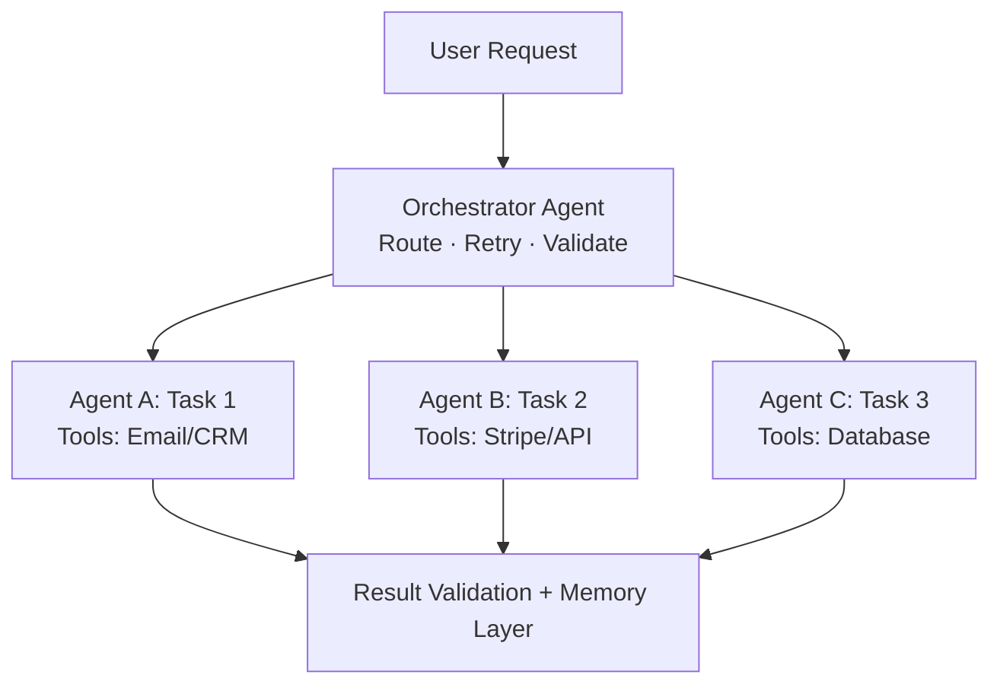

# AI Agent Architecture Template

> [!abstract] Core Principle
> The orchestration layer is the new interface layer — whoever owns the coordination layer owns the entire process. (Scott Belsky) Prioritize automating mechanical tasks; keep judgment tasks human.

---

## Technical Path Selection

Based on the user's technical background ([user-described skill level]), recommended path:

- **Choice** — [No-code / Code-first / Hybrid path]
- **Rationale** — [analysis]

---

## Agent Workflow Design

### Priority Automation (Mechanical Tasks)

| Task | Agent Approach | Tools / APIs | Difficulty | Priority |
|------|---------------|-------------|------------|----------|
| [Task 1] | [approach] | [tools] | Low / Med / High | P0 |
| [Task 2] | [approach] | [tools] | Low / Med / High | P1 |

### Keep Manual (Judgment Tasks)

| Task | Reason to Keep Manual | Future Automation Trigger |
|------|----------------------|--------------------------|
| [Task 1] | [why judgment is required] | [when it could be automated] |

---

## Tech Stack

| Purpose | Recommended Tool | Alternative | Monthly Cost |
|---------|-----------------|-------------|-------------|
| **Agent Framework** | [tool] | [backup] | $[X] |
| **Tool Integration** | [MCP / Zapier] | [backup] | $[X] |
| **Storage / Memory Layer** | [tool] | [backup] | $[X] |
| **Monitoring / Logging** | [tool] | [backup] | $[X] |

- **Total monthly tooling cost** — $[X]/month

---

## Orchestration Layer

---

## MVP Recommendation

> [!important] The First Feature to Build
> - **Specific description** — [non-abstract recommendation]
> - **Why start here** — [rationale]
> - **Estimated development time** — [estimate based on user's technical level]
