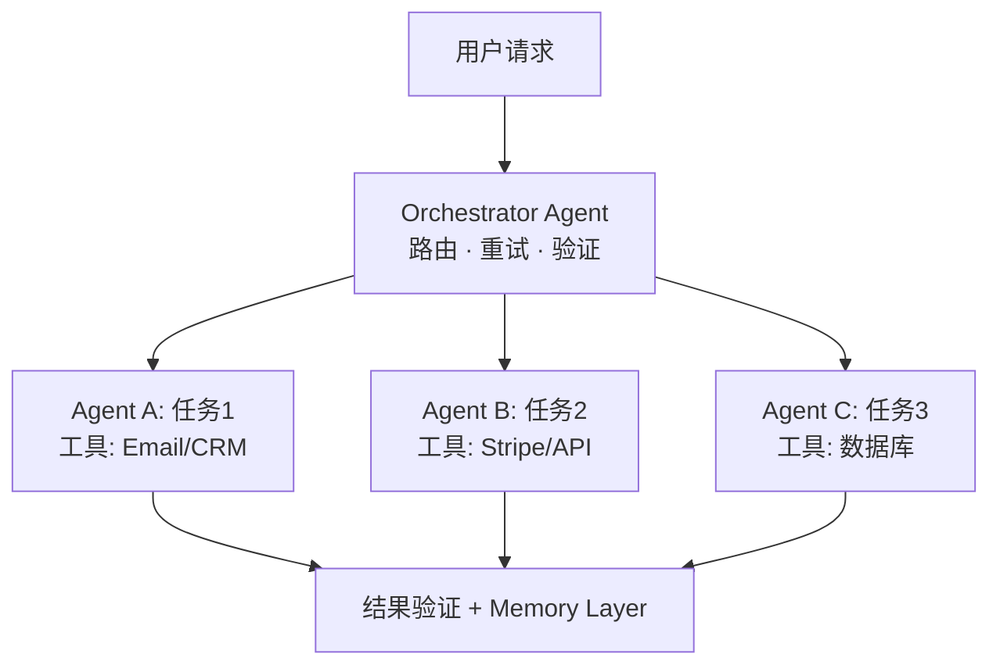

# AI Agent Architecture 技术方案模版

> [!abstract] 核心原则
> 编排层是新的界面层——谁拥有协调层，谁就拥有整个流程。（Scott Belsky）优先自动化机械任务，判断任务保留人工。

---

## Technical Path Selection

基于用户技术背景（[用户描述的技术水平]），推荐路径：

- **选择** — [No-code / Code-first / 混合路径]
- **理由** — [分析]

---

## Agent Workflow Design

### Priority Automation（Mechanical Tasks）

| 任务 | Agent 方案 | 工具 / API | 难度 | 优先级 |
|------|----------|-----------|------|--------|
| [任务1] | [方案] | [工具] | 低 / 中 / 高 | P0 |
| [任务2] | [方案] | [工具] | 低 / 中 / 高 | P1 |

### Keep Manual（Judgment Tasks）

| 任务 | 保留原因 | 未来自动化时机 |
|------|---------|---------------|
| [任务1] | [需要判断力的原因] | [何时可以自动化] |

---

## Tech Stack

| 用途 | 推荐工具 | 替代方案 | 月成本 |
|------|----------|---------|--------|
| **Agent 框架** | [工具] | [备选] | $[X] |
| **工具集成** | [MCP / Zapier] | [备选] | $[X] |
| **存储 / 记忆层** | [工具] | [备选] | $[X] |
| **监控 / 日志** | [工具] | [备选] | $[X] |

- **月度工具总成本** — $[X]/月

---

## Orchestration Layer

---

## MVP Recommendation

> [!important] 第一个要 Build 的功能
> - **具体描述** — [非抽象建议]
> - **为什么从这里开始** — [原因]
> - **预计开发时间** — [基于用户技术水平的估算]
