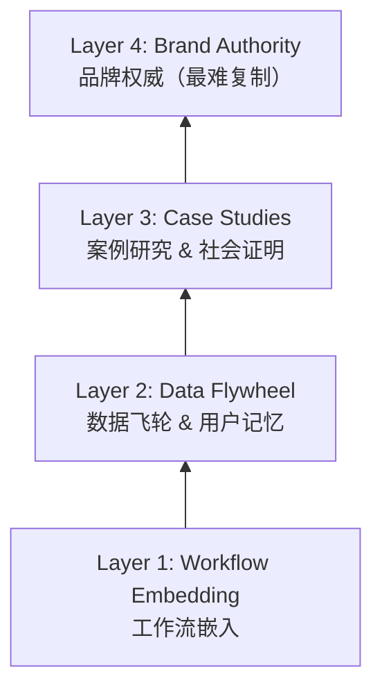

# Moat Building Checklist 护城河构建清单

> [!abstract] 核心逻辑
> AI SaaS 的护城河不是技术本身（AI 能力在快速商品化），而是数据、习惯和信任的积累。谁先在子利基内建立这些壁垒，谁就赢。

---

## 四层护城河模型

---

## Layer 1 — Workflow Embedding

让你的产品成为用户日常工作流的一部分，而不是可选工具。

- [ ] **覆盖完整工作流** — 产品覆盖至少 1 个端到端工作流
- [ ] **连接现有工具** — 通过 MCP / API 连接用户现有工具（Email、CRM、Slack 等）
- [ ] **日常使用** — 用户每天至少使用 1 次
- [ ] **嵌入资金流转** — 产品嵌入了至少 1 个资金流转环节

> [!tip] 关键指标
> DAU/MAU ratio > 0.3（说明用户在日常使用）

---

## Layer 2 — Data Flywheel & Memory

产品越用越好用，数据积累成为迁移成本。

### Data Flywheel Design

| 数据类型 | 来源 | 如何让产品变好 | 迁移成本 |
|----------|------|--------------|---------|
| **User Preferences** | Onboarding + 日常交互 | 个性化推荐/默认值 | 重新配置的时间 |
| **Historical Data** | 工作流执行记录 | 趋势分析/预测 | 数据导出的完整度 |
| **Templates & Rules** | 用户自定义 | 效率提升 | 重建自定义的成本 |
| **Industry Data** | 聚合多用户数据 | Benchmark / 最佳实践 | 独有洞察，无法复制 |

### Memory Layer Design

| 记忆内容 | 存储方式 | 使用方式 |
|----------|---------|---------|
| 命名习惯、偏好术语 | Profile / Preferences | 输出中使用用户习惯的表达 |
| 历史决策和原因 | Decision Log | 未来类似场景时参考 |
| 常用模版和工作流 | Templates Library | 一键复用 |
| 团队/客户信息 | Context Store | 自动填充、个性化 |

- [ ] **推荐准确率** — 新用户使用 1 个月后，产品推荐准确率明显提升
- [ ] **自定义积累** — 用户自定义内容积累到迁移成本 > 重新配置的意愿
- [ ] **聚合洞察** — 有聚合数据层，能提供单个用户无法获得的洞察

---

## Layer 3 — Case Studies & Social Proof

用真实的客户成功故事支撑你的定价和获客。

### 执行计划

| 阶段 | 时间线 | 目标 | 行动 |
|------|--------|------|------|
| **Seed** | Month 1–3 | 3 个深度用户 | 免费或折扣换取反馈 + 使用数据 |
| **Collect** | Month 3–6 | 3 个量化案例 | 记录节省时间/增加收入的具体数字 |
| **Amplify** | Month 6–12 | 3 个视频案例 | 拍摄客户证言视频，投放为付费广告 |

### 案例模版

> [!example] Case Study Template
> **背景** — [客户的角色、行业、规模]
> **痛点** — [使用你的产品之前的具体问题]
> **方案** — [如何使用你的产品解决问题]
> **成果：**
> - 节省时间：[X 小时/周] → [Y 小时/周]
> - 收入影响：[具体数字]
> - ROI：投入 $A/月，回报 $B/月
>
> **客户原话** — *"[直接引用]"*

- [ ] **公开分享** — 至少 3 个客户愿意公开分享使用体验
- [ ] **量化数据** — 至少 1 个案例有具体的量化数据
- [ ] **视频案例** — 至少 1 个视频案例研究

---

## Layer 4 — Brand Authority

在子利基内成为"默认选择"——当有人问"这个问题用什么工具？"时，你的名字第一个被提到。

- [ ] **社区推荐** — 在子利基社区/论坛中被主动推荐（非自己推广）
- [ ] **持续输出** — 有持续的教育性内容输出（不只是产品推广）
- [ ] **KOL 提及** — 被至少 1 个行业 KOL 或媒体提及
- [ ] **用户回流** — 客户流失后有用户主动回来的案例

> [!tip] 衡量标准
> 品牌搜索量趋势 ↑、NPS > 50、自然推荐占新客比例 > 30%

---

## Quarterly Health Score

每季度评估一次：

| 层级 | 权重 | 评分 (1–5) | 加权分 |
|------|------|-----------|--------|
| Layer 1: Workflow Embedding | 30% | | |
| Layer 2: Data Flywheel | 30% | | |
| Layer 3: Case Studies | 20% | | |
| Layer 4: Brand Authority | 20% | | |
| **总分** | | | **/5** |

> [!success] 4–5 分
> 护城河健康，可以提价。

> [!info] 3–4 分
> 基础稳固，继续深化。

> [!warning] 2–3 分
> 存在迁移风险，优先加固薄弱层。

> [!danger] < 2 分
> 几乎没有护城河，需要紧急行动。
