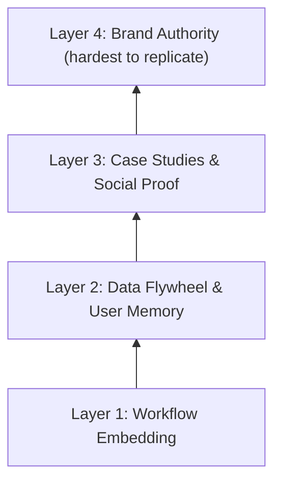

# Moat Building Checklist

> [!abstract] Core Logic
> The moat for an AI SaaS is not the technology itself (AI capabilities are commoditizing rapidly) — it is the accumulation of data, habits, and trust. Whoever builds these barriers first within a subniche wins.

---

## Four-Layer Moat Model

---

## Layer 1 — Workflow Embedding

Make your product a part of the user's daily workflow, not an optional tool.

- [ ] **Full workflow coverage** — Product covers at least 1 end-to-end workflow
- [ ] **Connects existing tools** — Integrates with user's existing tools via MCP / API (Email, CRM, Slack, etc.)
- [ ] **Daily usage** — Users engage with the product at least once per day
- [ ] **Embedded in money flow** — Product is embedded in at least 1 money touchpoint

> [!tip] Key Metric
> DAU/MAU ratio > 0.3 (indicates users are engaging daily)

---

## Layer 2 — Data Flywheel & Memory

The product gets better with use; accumulated data becomes switching cost.

### Data Flywheel Design

| Data Type | Source | How It Improves the Product | Switching Cost |
|-----------|--------|----------------------------|----------------|
| **User Preferences** | Onboarding + daily interaction | Personalized recommendations / defaults | Time to reconfigure |
| **Historical Data** | Workflow execution records | Trend analysis / prediction | Completeness of data export |
| **Templates & Rules** | User customizations | Efficiency gains | Cost to rebuild customizations |
| **Industry Data** | Aggregated across users | Benchmarks / best practices | Proprietary insights, non-replicable |

### Memory Layer Design

| Memory Content | Storage Method | Usage |
|---------------|---------------|-------|
| Naming conventions, preferred terminology | Profile / Preferences | Apply user's preferred expressions in outputs |
| Historical decisions and rationale | Decision Log | Reference in future similar scenarios |
| Frequently used templates and workflows | Templates Library | One-click reuse |
| Team / client information | Context Store | Auto-fill, personalization |

- [ ] **Recommendation accuracy** — After 1 month of use, product recommendations noticeably improve for the user
- [ ] **Accumulated customization** — User's custom content has accumulated to the point where switching cost exceeds willingness to reconfigure
- [ ] **Aggregated insights** — Has an aggregated data layer providing insights no single user could obtain alone

---

## Layer 3 — Case Studies & Social Proof

Use real customer success stories to support your pricing and acquisition.

### Execution Plan

| Phase | Timeline | Target | Action |
|-------|----------|--------|--------|
| **Seed** | Month 1–3 | 3 deep users | Free or discounted in exchange for feedback + usage data |
| **Collect** | Month 3–6 | 3 quantified case studies | Document specific numbers: time saved / revenue gained |
| **Amplify** | Month 6–12 | 3 video case studies | Film customer testimonial videos; use as paid ad creative |

### Case Study Template

> [!example] Case Study Template
> **Background** — [customer's role, industry, company size]
> **Pain Point** — [specific problem before using your product]
> **Solution** — [how they used your product to solve it]
> **Results:**
> - Time saved: [X hours/week] → [Y hours/week]
> - Revenue impact: [specific number]
> - ROI: invested $A/month, returned $B/month
>
> **Customer quote** — *"[direct quote]"*

- [ ] **Willing to share publicly** — At least 3 customers willing to share their experience publicly
- [ ] **Quantified data** — At least 1 case study with specific quantified data
- [ ] **Video case study** — At least 1 video case study

---

## Layer 4 — Brand Authority

Become the "default choice" within your subniche — when someone asks "what tool do I use for this?", your name is mentioned first.

- [ ] **Community recommendations** — Actively recommended in subniche communities / forums (not self-promoted)
- [ ] **Consistent output** — Ongoing educational content output (not just product promotion)
- [ ] **KOL mentions** — Mentioned by at least 1 industry KOL or media outlet
- [ ] **User return rate** — Cases of churned users actively coming back

> [!tip] Measurement Standards
> Brand search volume trending upward, NPS > 50, organic referrals account for > 30% of new customers

---

## Quarterly Health Score

Evaluate once per quarter:

| Layer | Weight | Score (1–5) | Weighted Score |
|-------|--------|-------------|---------------|
| Layer 1: Workflow Embedding | 30% | | |
| Layer 2: Data Flywheel | 30% | | |
| Layer 3: Case Studies | 20% | | |
| Layer 4: Brand Authority | 20% | | |
| **Total** | | | **/5** |

> [!success] 4–5
> Moat is healthy — consider raising prices.

> [!info] 3–4
> Foundation is solid — continue deepening.

> [!warning] 2–3
> Migration risk exists — prioritize reinforcing the weakest layer.

> [!danger] < 2
> Almost no moat — urgent action required.
