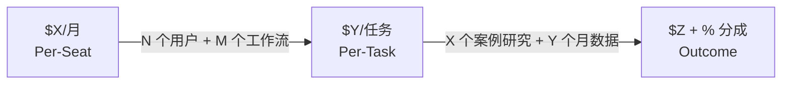

# Pricing Evolution Roadmap 定价进化路线图模版

> [!abstract] 核心趋势
> 传统 SaaS 的按席位模式正在被 AI 颠覆——用户想要的是"帮我完成这个任务"而不是"给我一个工具"。定价进化路径：Per-Seat → Per-Task → Outcome。

---

## ROI Anchor（所有定价的基础）

> [!example] 价值主张公式
> *"我帮 [目标客户] 每 [月/年] 节省 [X 小时]，相当于 $[Y] 的时间价值，同时帮他们多获得 [Z 个 leads / 合同 / etc.]。"*

| 指标 | 数值 |
|------|------|
| **客户时薪（估算）** | $[X]/小时 |
| **你节省的时间** | [Y] 小时/月 |
| **创造的 ROI** | $[X×Y]/月 |
| **你的定价占 ROI 比例** | [Z%]（健康范围：10–20%） |

---

## Phase 1 — Per-Seat Pricing（起步阶段）

| 方案 | 价格 | 包含功能 | 目标客户类型 |
|------|------|---------|------------|
| Starter | $[X]/月 | [功能列表] | [描述] |
| Pro | $[Y]/月 | [功能列表] | [描述] |

- **何时开始收费** — [具体条件，如：5 个测试用户验证价值后]
- **定价 Pitch 话术** — [具体话术]

---

## Phase 2 — Per-Task Pricing（成长阶段）

- **触发条件** — [什么时候切换，如：完成 X 个工作流自动化 / 有 Y 个付费用户]
- **定价单位** — 每次 [完成什么] = $[X]
- **月度预期** — 平均每个客户 [N 次任务] × $[X] = $[Y]/月/客户
- **接受度测试** — [如何试探市场对这种定价的反应]

---

## Phase 3 — Outcome Pricing（终极目标）

- **结果指标** — [你帮客户实现的可量化结果]
- **定价结构** — [固定基础费 + 按结果分成，或其他模式]
- **前提条件** — [品牌信任度 / 数据积累 / 案例研究]

---

## Pricing Evolution Timeline

---

## Pricing Moat 定价护城河

随着定价提升，同步建设：

1. **Data Flywheel** — [如何让用户数据积累变成 switching cost]
2. **Case Studies** — 目标：在 [X] 个月内获得 [N] 个公开视频案例研究
3. **Brand Authority** — [内容策略如何支撑溢价定价]
