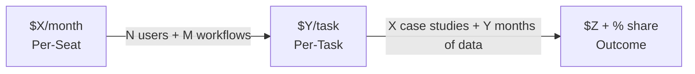

# Pricing Evolution Roadmap Template

> [!abstract] Core Trend
> The traditional per-seat SaaS model is being disrupted by AI — users want "get this task done for me," not "give me a tool." Pricing evolution path: Per-Seat → Per-Task → Outcome.

---

## ROI Anchor (Foundation for All Pricing)

> [!example] Value Proposition Formula
> *"I help [target customer] save [X hours] every [month/year], equivalent to $[Y] in time value, while also helping them gain [Z leads / contracts / etc.]."*

| Metric | Value |
|--------|-------|
| **Customer hourly rate (estimate)** | $[X]/hour |
| **Time you save them** | [Y] hours/month |
| **ROI created** | $[X×Y]/month |
| **Your pricing as % of ROI** | [Z%] (healthy range: 10–20%) |

---

## Phase 1 — Per-Seat Pricing (Early Stage)

| Plan | Price | Included Features | Target Customer Type |
|------|-------|------------------|---------------------|
| Starter | $[X]/month | [feature list] | [description] |
| Pro | $[Y]/month | [feature list] | [description] |

- **When to start charging** — [specific condition, e.g., after 5 test users validate value]
- **Pricing pitch script** — [specific language to use]

---

## Phase 2 — Per-Task Pricing (Growth Stage)

- **Trigger condition** — [when to switch, e.g., after completing X workflow automations / having Y paying users]
- **Pricing unit** — Per [what is completed] = $[X]
- **Monthly expectation** — Average customer [N tasks] × $[X] = $[Y]/month/customer
- **Acceptance test** — [how to gauge market receptiveness to this pricing model]

---

## Phase 3 — Outcome Pricing (Ultimate Goal)

- **Outcome metric** — [the quantifiable result you deliver for customers]
- **Pricing structure** — [fixed base fee + outcome-based share, or other model]
- **Prerequisites** — [brand trust / data accumulation / case studies]

---

## Pricing Evolution Timeline

---

## Pricing Moat

As pricing increases, build in parallel:

1. **Data Flywheel** — [how user data accumulation becomes switching cost]
2. **Case Studies** — Target: obtain [N] public video case studies within [X] months
3. **Brand Authority** — [how content strategy supports premium pricing]
